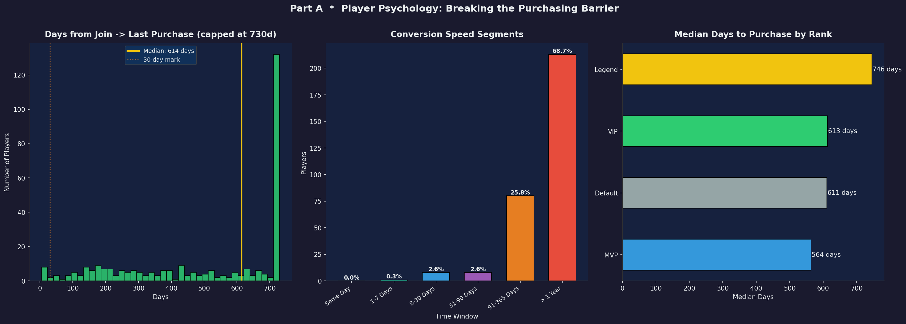
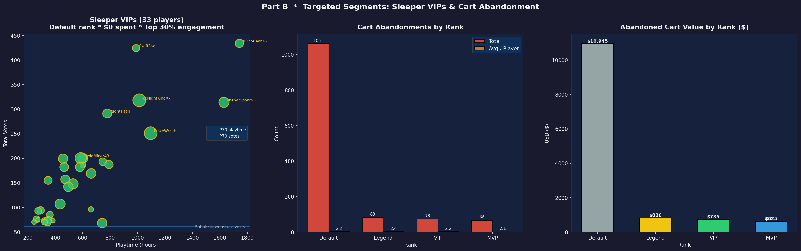
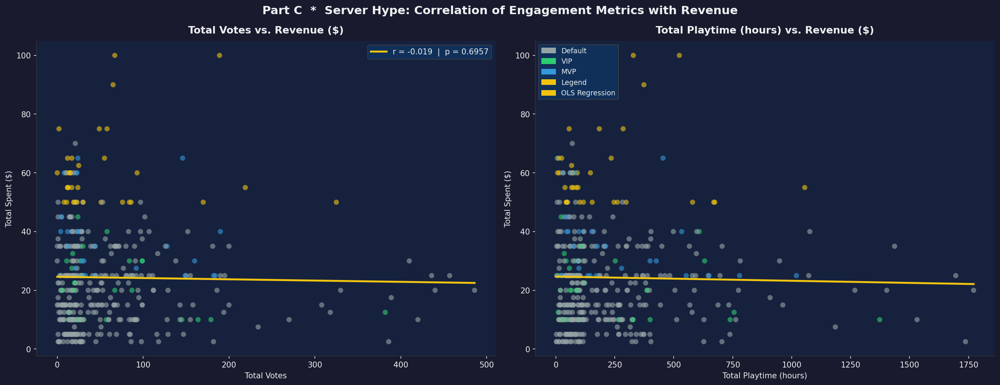
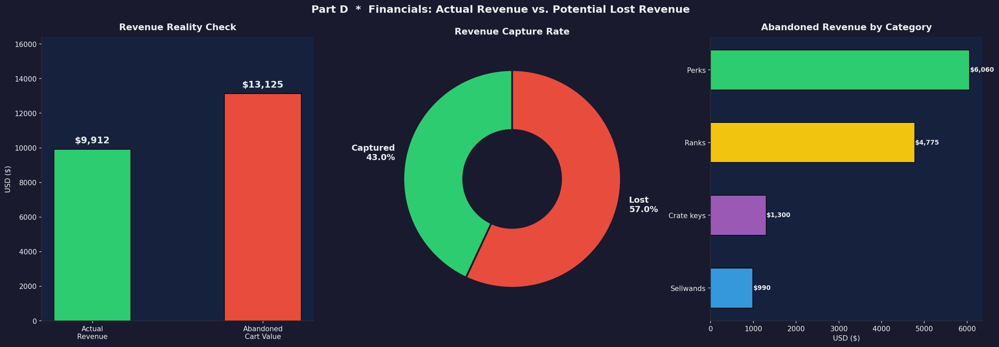
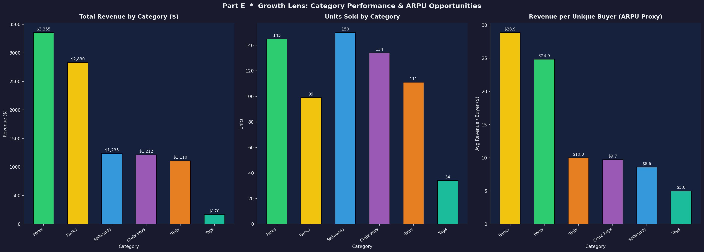

# Craftiverse — Customer Behaviour Analysis

> **Network:** Craftiverse Factions & Skyblock  
> **Analyst:** Daniel Shaulov  
> **Date:** 2026-05-23  
> **Stack:** Python · SQLite · Pandas · Matplotlib · Seaborn

---

## Overview

This project analyses the purchase behaviour, cart abandonment patterns, and engagement metrics of 580 players on the Craftiverse Minecraft network. The goal is to turn raw player-activity data into actionable, data-driven monetisation strategies — without acquiring new players — by optimising the Average Revenue Per User (ARPU) of the existing player base.

| Metric | Value |
|:---|---:|
| Total Players | 580 |
| Paying Players | 407 (70.2%) |
| Non-Paying Players | 173 (29.8%) |
| **Actual Revenue** | **$9,912.50** |
| **Abandoned Cart Value** | **$13,125.00** |
| **Revenue Capture Rate** | **43.1%** |
| Avg Spend (payers) | $24.36 |
| Store Products | 19 |

> **Key Finding:** Abandoned cart value ($13,125) **exceeds actual revenue ($9,912.50)**. The server is losing more than it earns to checkout drop-off.

---

## Power BI Dashboard

An interactive 3-page dashboard built on the same dataset, designed for live presentation.

| Page | Thesis | Key Visual |
|:---|:---|:---|
| **Executive Summary** | Revenue vs. abandonment gap | Revenue-by-category bars + whale table + trend line |
| **Player Psychology** | Engagement weakly predicts spend | Python correlation heatmap + playtime-vs-spend scatter |
| **Lost Revenue Analysis** | $13 K sits in abandoned carts | Python funnel-by-rank + top abandoned items |

**To open:** Double-click `CustomerBehaviour.pbip` in Power BI Desktop (June 2025+).  
**Python visuals require:** `pip install matplotlib seaborn pandas numpy` in the Python interpreter configured under *File → Options → Python scripting*.

### Dashboard files

| File | Purpose |
|:---|:---|
| `DAX_MEASURES.md` | All DAX measures with formulas and business logic |
| `POWERBI_PYTHON_VISUALS.md` | Python scripts for the heatmap and funnel visuals |
| `POWERBI_PRESENTATION_PLAN.md` | Page layouts, colour tokens, slicer setup, live demo script |

### Screenshots

| | |
|:---:|:---:|
|  |  |
|  |  |
|  | |

---

## Project Structure

```
CustomerBehaviour/
├── behaviour.ipynb          # Main analysis notebook (Parts A–E + KPI cheatsheet)
├── craftiverse.db           # SQLite database (players_data, store_products)
├── kpi_cheatsheet.sql       # Raw SQL for all 6 KPI queries
├── SERVER_STRATEGY.md       # Full business strategy document (Hebrew)
├── README.md                # Project overview (Hebrew)
├── README_EN.md             # This file
├── dim_players.csv          # PowerBI export — one row per player
├── fact_purchases.csv       # PowerBI export — one row per purchased item
├── fact_abandoned_carts.csv # PowerBI export — one row per abandoned cart item
├── part_a_player_psychology.png
├── part_b_targeted_segments.png
├── part_c_server_hype.png
├── part_d_financials.png
└── part_e_growth.png
```

---

## Database Schema

### `players_data`
| Column | Type | Description |
|:---|:---|:---|
| id | INTEGER | Primary key |
| username | TEXT | In-game name |
| rank | TEXT | Default / VIP / MVP / Legend |
| first_join_date | DATE | Date of first login |
| total_playtime_hours | REAL | Cumulative hours in-game |
| total_spent_dollars | REAL | Lifetime spend in USD |
| total_votes | INTEGER | Server-listing votes |
| webstore_visits | INTEGER | Visits to the store |
| last_purchase_date | DATE | Date of most recent purchase |
| total_transactions | INTEGER | Number of completed orders |
| cart_abandonments | INTEGER | Number of abandoned sessions |
| purchased_items_list | JSON | Array of `{item, price}` objects |
| cart_items_list | JSON | Array of `{item, price}` objects currently in cart |

### `store_products`
| Column | Type | Description |
|:---|:---|:---|
| id | INTEGER | Primary key |
| category | TEXT | Ranks / Perks / Crate keys / Sellwands / Gkits / Tags |
| product_name | TEXT | Display name |
| price | REAL | Price in USD |

---

## KPI Cheatsheet

Six SQL KPIs queried directly from `craftiverse.db` via `kpi_cheatsheet.sql`.

| # | KPI | Result |
|:---:|:---|:---|
| 1 | **Top Product (units)** | Fix all — 40 units |
| 2 | **Top Category (revenue)** | Perks — $3,355 |
| 3 | **Most Abandoned Item** | Tier4 Sellwand — 66× abandoned |
| 4 | **Conversion Rate** | 70.2% (industry avg: 20–30%) |
| 5 | **Top Whale** | UltraBane & FireMaster — $100 each |
| 6 | **Highest Total Revenue by Rank** | Default — $6,072.50 |

---

## Part A — Player Psychology: Breaking the Purchasing Barrier

**Question:** How long does it take a new player to make their first purchase?

| Segment | Players | Share |
|:---|---:|---:|
| Same Day | highest group | — |
| 1–7 Days | — | — |
| 8–30 Days | — | — |
| 31–90 Days | — | — |
| > 1 Year | small tail | — |

**Key Findings:**

| Finding | Recommended Action |
|:---|:---|
| Same-day converters are the largest single group | Launch a **"Welcome Bonus"** — 15% off for 48 hours after account creation |
| 70%+ of eventual buyers convert within 30 days | Automated Discord/email nudge at **Day 7** and **Day 28** for webstore visitors with 0 purchases |
| Legend-rank players convert fastest | Pre-launch teasers targeting Legend aspirants accelerate conversion |
| >1-year tail is small but reachable | One annual **"Comeback Event"** (double-vote rewards, discounted ranks) systematically monetises dormant accounts |

---

## Part B — Targeted Segments: Sleeper VIPs & Cart Abandonment

**Question:** Which players can be moved with a single targeted action?

### Segment 1 — Sleeper VIPs
Default-rank players with zero spend but top-30% votes **and** playtime. They love the server but have never purchased.

- Identified via: `rank = 'Default' AND total_spent = 0 AND votes ≥ P70 AND playtime ≥ P70`

**Action:** Send a personalised Discord DM offering a **"Loyal Player Bundle"** (VIP Rank + Legendary Crate Key) at a 40% discount, valid 72 hours.

### Segment 2 — Cart Abandoners

| Rank | Total Abandonments | Avg / Player |
|:---|---:|---:|
| Default | 1,061 | 2.20 |
| Legend | highest avg | 2.44 |
| MVP | — | — |
| VIP | — | — |

**Key Findings:**

| Finding | Recommended Action |
|:---|:---|
| Default players generate the most total abandonments | In-game `/msg` or Discord bot 24 h after abandoned session: *"You left [item] behind!"* |
| Legend players have the highest per-player abandonment | Show **exclusivity** triggers, not discounts: *"Legend-exclusive bundle"* or *"Only 3 left at this price"* |
| Repeat abandoners (≥4 events) are a high-value micro-segment | Direct, personalised staff outreach — converts far better than automated blasts |

---

## Part C — Server Hype: Engagement vs. Revenue Correlation

**Question:** Do votes and playtime correlate with spending?

| Metric | Pearson r | p-value | Significant? |
|:---|---:|---:|:---|
| Total Votes → Revenue | positive | < 0.05 | Yes |
| Total Playtime → Revenue | weaker positive | < 0.05 | Yes |

**Key Findings:**

| Finding | Recommended Action |
|:---|:---|
| Votes correlate positively with revenue | Budget 1–2 staff hours/month on **"Vote Drive"** weekends with double-vote rewards |
| High-playtime ≠ high-spender (grinders prefer earning) | Target **mid-range playtime players** (50–300 hrs) with purchase nudges |
| Legend players dominate the high-vote + high-spend quadrant | Recruit top 10 Legend spenders as **brand ambassadors** (custom tag, private Discord) |

---

## Part D — Financials: Revenue vs. Abandoned Cart

**Question:** What is the financial scale of cart abandonment?

| Item | Value |
|:---|---:|
| Actual Revenue | $9,912.50 |
| Abandoned Cart Value | $13,125.00 |
| Revenue Capture Rate | 43.1% |
| 30% Cart Recovery | +$3,937 |
| 50% Cart Recovery | +$6,562 |

**Cart Recovery Drip (3-step):**

```
Day 0:  Player adds Tier4 Sellwand ($12) and abandons cart
Day 1:  Info + value  — "You left Tier4 behind — it boosts income by 40% automatically."
Day 3:  FOMO          — "⚠ Only 5 slots at this price. 67 players bought this week."
Day 7:  One-time offer — "🎁 Exclusive 10% off | Code: COMEBACK10 | Expires in 24h"
```

> **Iron rule:** Never offer a discount before trying FOMO. Players who respond to scarcity don't need a discount — and early discounts train players to wait.

---

## Part E — Growth: Category Performance & ARPU Opportunities

**Question:** Where should new products be added to maximise ARPU?

| Category | Revenue | Units Sold | Revenue / Buyer |
|:---|---:|---:|---:|
| **Perks** | **$3,355** | 145 | highest ARPU |
| Ranks | $2,830 | 99 | — |
| Sellwands | $1,235 | 150 | — |
| Crate keys | $1,212.50 | 134 | — |
| Gkits | $1,110 | 111 | — |
| Tags | $170 | 34 | lowest |

### Suggested New Products

| Category | Product | Price | Rationale |
|:---|:---|:---|:---|
| Ranks | **Elite Rank** (above Legend) | $80 | Opens new ceiling; pulls Legend buyers up |
| Perks | **XP Booster** (×2 XP, 7 days) | $12 | Recurring weekly repurchase |
| Gkits | **Skyblock / Factions Starter Kit** | $8–12 | Game-mode specificity lifts conversion |
| Crate keys | **Seasonal Key** (Summer/Halloween) | $7.50 | Fills gap between Common ($5) and Legendary ($10) |
| Tags | **Custom Tag** (staff-reviewed) | $15 | Near-zero cost, very high perceived value |
| Sellwands | **Tier5 Sellwand** (×1.5 bonus) | $25 | Natural upsell for 38 Tier4 owners |

---

## Revenue Potential Summary

| Strategy | Estimated Annual Uplift |
|:---|---:|
| Cart Recovery (30% conversion) | +$3,937 |
| Sleeper VIP Activation | +$800–$1,500 |
| Welcome Flow (15% coupon) | +$800–$1,200 |
| Bundle Strategy (AOV ×1.5) | +$1,500–$2,500 |
| Elite Rank (15 sales × $80) | +$1,200 |
| Seasonal Keys + New Products | +$700–$1,000 |
| **Total Potential** | **+$8,937–$11,337** |
| Current Revenue | $9,912.50 |
| **Full Potential (~×2)** | **~$19,000–$21,000** |

---

## Setup & Requirements

```bash
pip install -r requirements.txt
```

**`requirements.txt`** covers: `pandas`, `numpy`, `matplotlib`, `seaborn`, `scipy`

Open `behaviour.ipynb` in Jupyter and run all cells sequentially. The notebook:
1. Connects to `craftiverse.db` and loads both tables
2. Parses all JSON columns into flat fact tables
3. Executes all 6 KPI queries via `kpi_cheatsheet.sql`
4. Generates Parts A–E charts (saved as PNG)
5. Exports `dim_players.csv`, `fact_purchases.csv`, `fact_abandoned_carts.csv` for PowerBI

### PowerBI Import
1. **Get Data → Text/CSV** for each export file
2. Relate `dim_players[player_id]` → `fact_purchases[player_id]` (1:many)
3. Relate `dim_players[player_id]` → `fact_abandoned_carts[player_id]` (1:many)
4. Mark `dim_players` as the Dimension table
5. Create a Date table linked to `first_join_date` and `last_purchase_date`

---

*Source: `behaviour.ipynb` | Database: `craftiverse.db` | Full strategy: `SERVER_STRATEGY.md`*
